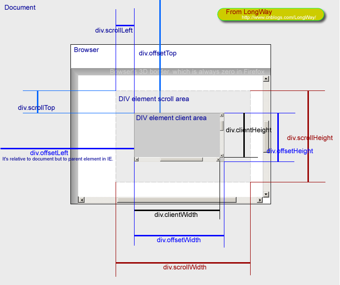

1. 可见区域 client**
2. 滚动区域获取 scroll **
3. 屏幕相关（非浏览器）screen**
4. 相对上层控件位置offset

getBoundingClientRect() 获取元素到body距离【element.getBoundingClientRect().x/y/z/left/top/right/bottom/width/height】right/bottom参考点在右下

scrollIntoView  让元素滚动到可视区

innerWidth 浏览器窗口可视区宽度（低版本IE的innerWidth：document.documentElement.clientWidth）

